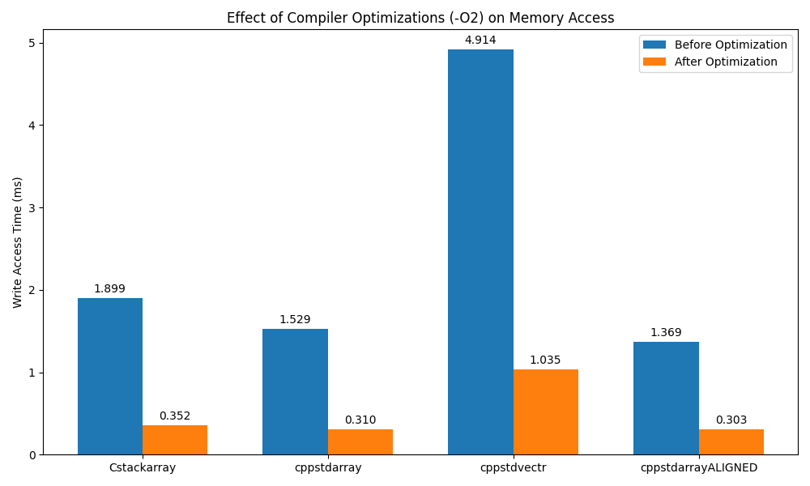

# o2bench
Raw C-Style array storage vs C++ STL containers (std::array and std::vector), before and after compiler
optimizations `-O2` and cache alignment `alignas(64)` 

# Purpose 
To compare the compiler's ability to optimize memory access operations based on the data structure. 

# Results


## Key Observations
**std::vector** has the highest allocation time both before and after optimization,
likely due to additional overhead from dynamic allocation

**std::array (aligned)** performs best in both scenarios, demonstrating the benefits
of memory alignment

**Compiler optimizations (-O2)** provide substantial performance improvements for
all data structures

The **relative improvement** from optimization is similar across all data structures
(81.4%, 79.7%, 78.9%, 77.9%)

## Optimization Impact
Average time reduction: 79.5%

All data structures show significant performance gains with compiler
optimizations, but the fundamental performance characteristics of each container
type are preserved.

Even with optimizations, std::vector remains significantly slower than
array-based alternatives for this particular initialization pattern.

# Compile

```
mkdir build
cd build 
cmake .. 
make 
```

# Run 

```
../run_tests.sh
```
